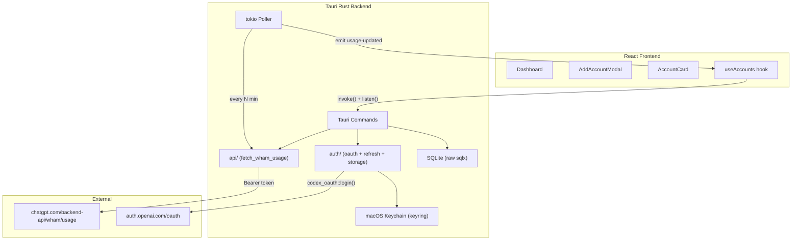

# Codex Account Usage Switcher — Complete Build Plan (Rev 3)

> Rev 3 incorporates the full review of Rev 2: every blocker, high, medium, and low-severity finding is applied inline. Critical changes are marked with **[Rev 3 fix]**.

## Architecture Overview



---

## 0. Prerequisites

> **[Rev 3 fix #1]** Rust ≥ 1.82 — `codex-oauth 0.1.0` MSRV is 1.82, not 1.77.

- Rust stable ≥ **1.82** (`rustup update stable`)
- Node.js ≥ 20, npm ≥ 10
- Xcode Command Line Tools (`xcode-select --install`)
- Tauri CLI v2 (`npm install -g @tauri-apps/cli@2`)
- Apple Developer Certificate (required for signed/notarized release builds; optional for local dev)

### Supply-chain note

`codex-oauth 0.1.0` is a small (≈200 LOC) third-party crate authored by `motosan-dev`, with very low download counts and a single version. It hardcodes OpenAI's Codex CLI `CLIENT_ID` and the `1455` callback port. Pin it strictly and consider vendoring its source into `vendor/codex-oauth/` before shipping; track upstream changes manually.

```toml
codex-oauth = "=0.1.0"
```

A `cargo deny` config is checked in at `src-tauri/deny.toml`; CI runs `cargo deny check` before `cargo build`.

---

## 1. Project Scaffold

```bash
npm create tauri-app@latest codex-switcher
# Prompts: React → TypeScript → npm
cd codex-switcher

# Frontend dependencies
# IMPORTANT: Use Tailwind v3 (NOT v4) — shadcn/ui is incompatible with v4
npm install -D tailwindcss@3 postcss autoprefixer
npx tailwindcss init -p

npm install date-fns lucide-react clsx tailwind-merge

# shadcn/ui (requires Tailwind v3)
npx shadcn@latest init   # choose: Default style, Zinc, CSS variables: yes

# Tauri plugin JS bindings
npm install @tauri-apps/plugin-dialog @tauri-apps/plugin-shell

# Do NOT install @tauri-apps/plugin-sql — we use raw sqlx in Rust only

npm run tauri dev        # verify scaffold works before proceeding
```

### `vite.config.ts` — no special changes needed for Tailwind v3 (uses PostCSS)

---

## 2. Cargo.toml — All Dependencies with Versions

```toml
[package]
name    = "codex-switcher"
version = "1.0.0"
edition = "2021"
rust-version = "1.82"          # [Rev 3 fix #1] codex-oauth requires 1.82+

[dependencies]
# Tauri — no tauri-plugin-sql; we use raw sqlx
tauri               = { version = "2",    features = ["tray-icon", "image-png"] }
tauri-plugin-dialog = "2"
tauri-plugin-shell  = "2"

# DB — raw sqlx, NOT tauri-plugin-sql
sqlx = { version = "0.8", features = ["runtime-tokio", "sqlite", "chrono"] }

# Serialization
serde      = { version = "1", features = ["derive"] }
serde_json = "1"

# Async runtime
tokio = { version = "1", features = ["full"] }

# HTTP (TLS via rustls, no OpenSSL dependency)
reqwest = { version = "0.12", features = ["json", "rustls-tls"], default-features = false }

# Auth — pin exactly; tiny third-party crate
codex-oauth = "=0.1.0"

# Security
keyring = "3"
zeroize = { version = "1", features = ["derive"] }

# Utilities
base64  = "0.22"
uuid    = { version = "1", features = ["v4"] }
chrono  = { version = "0.4", features = ["serde"] }
anyhow  = "1"
thiserror = "2"

# Logging
tracing            = "0.1"
tracing-subscriber = { version = "0.3", features = ["env-filter"] }

[build-dependencies]
tauri-build = "2"
```

---

## 3. Complete File Structure

```
codex-switcher/
├── package.json
├── vite.config.ts
├── tailwind.config.js          # Tailwind v3 (JS, not TS)
├── postcss.config.js           # required for Tailwind v3 with Vite
├── tsconfig.json
├── components.json             # shadcn/ui config
├── index.html
│
├── src/
│   ├── main.tsx
│   ├── App.tsx
│   ├── types.ts                # ALL TypeScript interfaces
│   ├── api.ts                  # Typed invoke() wrappers
│   │
│   ├── components/
│   │   ├── Dashboard.tsx
│   │   ├── BestAccountBanner.tsx
│   │   ├── AccountCard.tsx
│   │   ├── UsageBar.tsx
│   │   ├── CountdownTimer.tsx
│   │   ├── AddAccountModal.tsx
│   │   ├── SettingsPanel.tsx
│   │   └── EmptyState.tsx
│   │
│   ├── hooks/
│   │   ├── useAccounts.ts
│   │   └── useCountdown.ts
│   │
│   └── lib/
│       ├── utils.ts
│       └── time.ts
│
└── src-tauri/
    ├── Cargo.toml
    ├── Cargo.lock
    ├── build.rs
    ├── tauri.conf.json
    ├── Entitlements.plist
    ├── deny.toml                # [Rev 3] cargo-deny config
    ├── migrations/              # sqlx migration files
    │   └── 0001_initial.sql
    ├── capabilities/            # [Rev 3 fix #7] split window vs app scope
    │   ├── default.json         # window-scoped (path, event, window, dialog, shell)
    │   └── tray.json            # app-scoped (tray, menu)
    ├── icons/
    │   ├── icon.icns
    │   ├── icon.png
    │   └── tray-icon.png
    │
    └── src/
        ├── main.rs
        ├── error.rs             # AppError + Serialize impl (ApiError carries body)
        ├── state.rs             # AppState (sqlx pool, tokio::sync::Mutex, per-account locks, shutdown)
        ├── dto.rs               # All DTO structs with bool conversion
        │
        ├── db/
        │   └── mod.rs           # pool init helper
        │
        ├── api/
        │   └── mod.rs           # fetch_wham_usage(), tolerant WhamResponse structs
        │
        ├── auth/
        │   ├── mod.rs
        │   ├── oauth.rs         # do_login() using codex_oauth::login()
        │   ├── refresh.rs       # ensure_fresh_token()
        │   └── storage.rs       # StoredTokens, keychain_save/load/delete
        │
        ├── commands/
        │   ├── mod.rs
        │   ├── accounts.rs
        │   └── usage.rs
        │
        ├── tray.rs              # [Rev 3 fix #23] TrayIconBuilder setup
        └── poller.rs
```

---

## 4. Database Schema (`migrations/0001_initial.sql`)

> **[Rev 3 fix #20]** `trim_snapshots` rewritten to avoid the per-insert `COUNT(*)` + `NOT IN`.

```sql
CREATE TABLE IF NOT EXISTS accounts (
    id                TEXT PRIMARY KEY,
    label             TEXT NOT NULL,
    email             TEXT NOT NULL DEFAULT '',
    plan_type         TEXT NOT NULL DEFAULT 'unknown',
    session_status    TEXT NOT NULL DEFAULT 'active',
    created_at        INTEGER NOT NULL,
    last_refreshed_at INTEGER,
    sort_order        INTEGER NOT NULL DEFAULT 0
);

CREATE TABLE IF NOT EXISTS usage_snapshots (
    id                    INTEGER PRIMARY KEY AUTOINCREMENT,
    account_id            TEXT    NOT NULL REFERENCES accounts(id) ON DELETE CASCADE,
    fetched_at            INTEGER NOT NULL,
    primary_used_pct      REAL    NOT NULL,
    primary_reset_at      INTEGER NOT NULL,
    primary_window_secs   INTEGER NOT NULL,
    secondary_used_pct    REAL    NOT NULL,
    secondary_reset_at    INTEGER NOT NULL,
    secondary_window_secs INTEGER NOT NULL,
    limit_reached         INTEGER NOT NULL DEFAULT 0,
    credits_has_credits   INTEGER,
    credits_unlimited     INTEGER,
    credits_balance       REAL
);

CREATE INDEX IF NOT EXISTS idx_snapshots_account_time
    ON usage_snapshots(account_id, fetched_at DESC);

-- Trim trigger: index-only deletion using fetched_at boundary, no COUNT(*).
-- Removes rows older than the 200th-most-recent for the same account.
CREATE TRIGGER IF NOT EXISTS trim_snapshots
AFTER INSERT ON usage_snapshots
BEGIN
    DELETE FROM usage_snapshots
    WHERE account_id = NEW.account_id
      AND fetched_at < COALESCE((
        SELECT fetched_at FROM usage_snapshots
        WHERE account_id = NEW.account_id
        ORDER BY fetched_at DESC
        LIMIT 1 OFFSET 200
      ), 0);
END;

CREATE TABLE IF NOT EXISTS settings (
    key   TEXT PRIMARY KEY,
    value TEXT NOT NULL
);
INSERT OR IGNORE INTO settings VALUES ('poll_interval_minutes', '15');
INSERT OR IGNORE INTO settings VALUES ('token_refresh_days',    '7');
```

---

## 5. `db/mod.rs` — Pool Initialization

> **[Rev 3 fix #8]** Use `SqliteConnectOptions::new().filename(...)` rather than the URL form, so paths with spaces/non-ASCII work.

```rust
use sqlx::{
    sqlite::{SqliteConnectOptions, SqliteJournalMode},
    SqlitePool,
};
use std::path::Path;

pub async fn init_pool(app_data_dir: &Path) -> Result<SqlitePool, sqlx::Error> {
    let db_path = app_data_dir.join("codex_switcher.db");

    let opts = SqliteConnectOptions::new()
        .filename(&db_path)
        .create_if_missing(true)
        .journal_mode(SqliteJournalMode::Wal)
        .foreign_keys(true);

    let pool = SqlitePool::connect_with(opts).await?;

    sqlx::migrate!("./migrations").run(&pool).await?;

    Ok(pool)
}
```

---

## 6. `error.rs` — Tauri 2 Compatible Error Type

> **[Rev 3 fix #29]** `ApiError` now carries the response body so undocumented endpoint failures are debuggable.
> Tauri 2 requires `Serialize`. Commands return `Result<T, AppError>`.

```rust
use serde::Serialize;

#[derive(thiserror::Error, Debug)]
pub enum AppError {
    #[error("OAuth login failed: {0}")]                  OAuthFailed(String),
    #[error("Token refresh failed: {0}")]                RefreshFailed(String),
    #[error("Session expired")]                          TokenExpired,
    #[error("Network error: {0}")]                       Network(String),
    #[error("API error {code}: {body}")]                 ApiError { code: u16, body: String },
    #[error("Rate limited — retry later")]               RateLimited,
    #[error("Database error: {0}")]                      Database(String),
    #[error("Keychain error: {0}")]                      Keychain(String),
    #[error("Invalid JWT")]                              InvalidJwt,
    #[error("Account not found: {0}")]                   NotFound(String),
    #[error("JSON error: {0}")]                          Json(String),
    #[error("Port 1455 in use — close Codex CLI first")] Port1455InUse,
}

impl Serialize for AppError {
    fn serialize<S: serde::Serializer>(&self, s: S) -> Result<S::Ok, S::Error> {
        s.serialize_str(&self.to_string())
    }
}

impl From<sqlx::Error>        for AppError { fn from(e: sqlx::Error)        -> Self { AppError::Database(e.to_string()) } }
impl From<reqwest::Error>     for AppError { fn from(e: reqwest::Error)     -> Self { AppError::Network(e.to_string()) } }
impl From<serde_json::Error>  for AppError { fn from(e: serde_json::Error)  -> Self { AppError::Json(e.to_string()) } }

pub type AppResult<T> = Result<T, AppError>;
```

---

## 7. `state.rs`

> **[Rev 3 fix #9, #17, #22]** HTTP client has timeouts; per-account mutex prevents refresh/re-login races; shutdown channel for graceful poller exit.

```rust
use sqlx::SqlitePool;
use std::collections::HashMap;
use std::sync::Arc;
use std::time::Duration;
use tokio::sync::{watch, Mutex};
use tokio::task::AbortHandle;

pub struct AppState {
    pub db: SqlitePool,
    pub http: reqwest::Client,
    pub poller_handle: Mutex<Option<AbortHandle>>,
    pub account_locks: Mutex<HashMap<String, Arc<Mutex<()>>>>,
    pub shutdown_tx: watch::Sender<bool>,
    pub shutdown_rx: watch::Receiver<bool>,
}

impl AppState {
    pub fn new(db: SqlitePool) -> Self {
        let http = reqwest::Client::builder()
            .use_rustls_tls()
            .https_only(true)
            .timeout(Duration::from_secs(20))
            .connect_timeout(Duration::from_secs(10))
            .build()
            .expect("reqwest client");

        let (shutdown_tx, shutdown_rx) = watch::channel(false);

        Self {
            db,
            http,
            poller_handle: Mutex::new(None),
            account_locks: Mutex::new(HashMap::new()),
            shutdown_tx,
            shutdown_rx,
        }
    }

    /// Returns the per-account mutex, creating it on first use.
    /// Held by both `refresh_usage` and the re-login path of `login_account`
    /// to serialize keychain + accounts-row writes for a single account.
    pub async fn account_lock(&self, account_id: &str) -> Arc<Mutex<()>> {
        let mut locks = self.account_locks.lock().await;
        locks
            .entry(account_id.to_string())
            .or_insert_with(|| Arc::new(Mutex::new(())))
            .clone()
    }
}
```

---

## 8. `dto.rs` — DTO Structs with Bool Conversion

```rust
use serde::Serialize;

#[derive(sqlx::FromRow)]
pub struct UsageSnapshotRow {
    pub id:                    i64,
    pub account_id:            String,
    pub fetched_at:            i64,
    pub primary_used_pct:      f64,
    pub primary_reset_at:      i64,
    pub primary_window_secs:   i64,
    pub secondary_used_pct:    f64,
    pub secondary_reset_at:    i64,
    pub secondary_window_secs: i64,
    pub limit_reached:         i64,
    pub credits_has_credits:   Option<i64>,
    pub credits_unlimited:     Option<i64>,
    pub credits_balance:       Option<f64>,
}

#[derive(Serialize, Clone)]
pub struct UsageSnapshotDto {
    pub id:                    i64,
    pub account_id:            String,
    pub fetched_at:            i64,
    pub primary_used_pct:      f64,
    pub primary_reset_at:      i64,
    pub primary_window_secs:   i64,
    pub secondary_used_pct:    f64,
    pub secondary_reset_at:    i64,
    pub secondary_window_secs: i64,
    pub limit_reached:         bool,
    pub credits_has_credits:   Option<bool>,
    pub credits_unlimited:     Option<bool>,
    pub credits_balance:       Option<f64>,
}

impl From<UsageSnapshotRow> for UsageSnapshotDto {
    fn from(r: UsageSnapshotRow) -> Self {
        Self {
            id:                    r.id,
            account_id:            r.account_id,
            fetched_at:            r.fetched_at,
            primary_used_pct:      r.primary_used_pct,
            primary_reset_at:      r.primary_reset_at,
            primary_window_secs:   r.primary_window_secs,
            secondary_used_pct:    r.secondary_used_pct,
            secondary_reset_at:    r.secondary_reset_at,
            secondary_window_secs: r.secondary_window_secs,
            limit_reached:         r.limit_reached != 0,
            credits_has_credits:   r.credits_has_credits.map(|v| v != 0),
            credits_unlimited:     r.credits_unlimited.map(|v| v != 0),
            credits_balance:       r.credits_balance,
        }
    }
}

#[derive(Serialize, Clone, sqlx::FromRow)]
pub struct AccountRow {
    pub id:                String,
    pub label:             String,
    pub email:             String,
    pub plan_type:         String,
    pub session_status:    String,
    pub created_at:        i64,
    pub last_refreshed_at: Option<i64>,
    pub sort_order:        i64,
}

#[derive(Serialize, Clone)]
pub struct AccountWithUsageDto {
    #[serde(flatten)]
    pub account:         AccountRow,
    pub latest_snapshot: Option<UsageSnapshotDto>,
}

#[derive(Serialize, serde::Deserialize)]
pub struct SettingsDto {
    pub poll_interval_minutes: u64,  // 5 | 10 | 15 | 30 | 60
    pub token_refresh_days:    u64,  // 7 (not user-configurable in UI)
}
```

---

## 9. `auth/storage.rs` — Keychain

> **[Rev 3 fix #19]** `ZeroizeOnDrop` is dropped from the public API surface — `keyring` and `serde_json::to_string` both make secret-bearing copies that we cannot zero. The Security Summary in §24 reflects this honestly.

```rust
use crate::error::AppError;
use keyring::Entry;
use serde::{Deserialize, Serialize};

const KEYCHAIN_SERVICE: &str = "com.motosan.codex-switcher";  // matches bundle id

#[derive(Serialize, Deserialize, Clone)]
pub struct StoredTokens {
    pub access_token:  String,
    pub refresh_token: String,
    pub id_token:      String,
    pub account_id:    String,
    pub expires_in:    u64,
    pub issued_at:     u64,
}

pub fn keychain_save(uuid: &str, t: &StoredTokens) -> Result<(), AppError> {
    let json = serde_json::to_string(t).map_err(AppError::from)?;
    Entry::new(KEYCHAIN_SERVICE, uuid)
        .map_err(|e| AppError::Keychain(e.to_string()))?
        .set_password(&json)
        .map_err(|e| AppError::Keychain(e.to_string()))
}

pub fn keychain_load(uuid: &str) -> Result<StoredTokens, AppError> {
    let json = Entry::new(KEYCHAIN_SERVICE, uuid)
        .map_err(|e| AppError::Keychain(e.to_string()))?
        .get_password()
        .map_err(|e| AppError::Keychain(e.to_string()))?;
    serde_json::from_str(&json).map_err(AppError::from)
}

pub fn keychain_delete(uuid: &str) -> Result<(), AppError> {
    Entry::new(KEYCHAIN_SERVICE, uuid)
        .map_err(|e| AppError::Keychain(e.to_string()))?
        .delete_credential()
        .map_err(|e| AppError::Keychain(e.to_string()))
}
```

---

## 10. `auth/oauth.rs` — Login

> **[Rev 3 fix #2]** JWT base64 fallback uses `URL_SAFE` (with padding), not `STANDARD` — the latter cannot decode JWT alphabets containing `-` or `_`.
> **[Rev 3 fix #15]** Preflight check on port 1455 before invoking `codex_oauth::login()`.
>
> `codex_oauth::Token` fields: `access_token`, `refresh_token`, `id_token`, `expires_in`, `issued_at`. `is_expired()` is provided.

```rust
use crate::api::fetch_wham_usage;
use crate::auth::storage::StoredTokens;
use crate::error::AppError;
use base64::{
    engine::general_purpose::{URL_SAFE, URL_SAFE_NO_PAD},
    Engine,
};
use codex_oauth::{login, Token};

pub struct LoginResult {
    pub tokens:    StoredTokens,
    pub email:     String,
    pub plan_type: String,
}

/// Returns true if TCP port 1455 is currently bound on localhost.
fn port_1455_in_use() -> bool {
    std::net::TcpListener::bind(("127.0.0.1", 1455)).is_err()
}

/// Full login flow. Opens system browser, blocks until user completes OAuth.
pub async fn do_login(http: &reqwest::Client) -> Result<LoginResult, AppError> {
    if port_1455_in_use() {
        return Err(AppError::Port1455InUse);
    }

    // codex_oauth::login() handles: PKCE, local server on 1455, browser open,
    // state validation, code exchange. 120s timeout enforced upstream.
    let token: Token = login()
        .await
        .map_err(|e| AppError::OAuthFailed(e.to_string()))?;

    let maybe_account_id = extract_account_id(&token.id_token).ok();

    // First API call: verify token works + get email/plan_type.
    // If JWT extraction failed, omit the header and adopt account_id from response.
    let usage = fetch_wham_usage(http, &token.access_token, maybe_account_id.as_deref()).await?;

    let account_id = maybe_account_id
        .or_else(|| usage.account_id.clone())
        .or_else(|| usage.user_id.clone())
        .ok_or(AppError::InvalidJwt)?;

    let tokens = StoredTokens {
        access_token:  token.access_token,
        refresh_token: token.refresh_token,
        id_token:      token.id_token,
        account_id,
        expires_in:    token.expires_in,
        issued_at:     token.issued_at,
    };

    Ok(LoginResult {
        email:     usage.email.unwrap_or_default(),
        plan_type: usage.plan_type.unwrap_or_else(|| "unknown".to_string()),
        tokens,
    })
}

/// Decodes JWT payload (no signature verification — only for extracting claims).
fn extract_account_id(jwt: &str) -> Result<String, AppError> {
    let parts: Vec<&str> = jwt.splitn(3, '.').collect();
    if parts.len() != 3 {
        return Err(AppError::InvalidJwt);
    }

    // Pad to make valid base64
    let pad = (4 - parts[1].len() % 4) % 4;
    let padded = format!("{}{}", parts[1], "=".repeat(pad));

    // Try unpadded URL-safe first; fall back to padded URL-safe.
    // [Rev 3 fix #2] No STANDARD fallback — JWTs use URL-safe alphabet.
    let bytes = URL_SAFE_NO_PAD
        .decode(parts[1])
        .or_else(|_| URL_SAFE.decode(&padded))
        .map_err(|_| AppError::InvalidJwt)?;

    let claims: serde_json::Value = serde_json::from_slice(&bytes).map_err(AppError::from)?;

    claims["https://api.openai.com/profile"]["user_id"]
        .as_str()
        .or_else(|| claims["sub"].as_str())
        .map(str::to_owned)
        .ok_or(AppError::InvalidJwt)
}
```

---

## 11. `auth/refresh.rs`

```rust
use crate::auth::storage::{keychain_save, StoredTokens};
use crate::error::AppError;
use codex_oauth::{refresh, Token};

pub async fn ensure_fresh_token(
    tokens: StoredTokens,
    account_uuid: &str,
    db: &sqlx::SqlitePool,
    refresh_threshold_days: u64,
) -> Result<StoredTokens, AppError> {
    let now_unix = chrono::Utc::now().timestamp() as u64;
    let age_secs = now_unix.saturating_sub(tokens.issued_at);
    let threshold_secs = refresh_threshold_days * 86400;

    let ot = Token {
        access_token:  tokens.access_token.clone(),
        refresh_token: tokens.refresh_token.clone(),
        id_token:      tokens.id_token.clone(),
        expires_in:    tokens.expires_in,
        issued_at:     tokens.issued_at,
    };

    if !ot.is_expired() && age_secs < threshold_secs {
        return Ok(tokens);
    }

    let new_token = refresh(&tokens.refresh_token)
        .await
        .map_err(|e| AppError::RefreshFailed(e.to_string()))?;

    let refreshed = StoredTokens {
        access_token:  new_token.access_token,
        refresh_token: new_token.refresh_token,
        id_token:      new_token.id_token,
        account_id:    tokens.account_id.clone(),
        expires_in:    new_token.expires_in,
        issued_at:     new_token.issued_at,
    };

    keychain_save(account_uuid, &refreshed)?;

    sqlx::query("UPDATE accounts SET last_refreshed_at = ?1 WHERE id = ?2")
        .bind(now_unix as i64)
        .bind(account_uuid)
        .execute(db)
        .await?;

    Ok(refreshed)
}
```

---

## 12. `api/mod.rs` — Usage Fetch

> **[Rev 3 fix #3]** All `Credits` fields are now `Option<…>` with `#[serde(default)]` — null/missing fields no longer break deserialization.
> **[Rev 3 fix #16]** `fetch_wham_usage` returns the response body in `ApiError { code, body }` for any non-200, non-401/403/429 status.

```rust
use crate::error::AppError;

const USAGE_URL: &str = "https://chatgpt.com/backend-api/wham/usage";

#[derive(serde::Deserialize, Default)]
#[serde(default)]
pub struct WhamResponse {
    pub user_id:    Option<String>,
    pub account_id: Option<String>,
    pub email:      Option<String>,
    pub plan_type:  Option<String>,
    pub rate_limit: Option<RateLimit>,
    pub credits:    Option<Credits>,
}

#[derive(serde::Deserialize, Default)]
#[serde(default)]
pub struct RateLimit {
    pub allowed:          Option<bool>,
    pub limit_reached:    Option<bool>,
    pub primary_window:   Option<Window>,
    pub secondary_window: Option<Window>,
}

#[derive(serde::Deserialize, Default)]
#[serde(default)]
pub struct Window {
    pub used_percent:         Option<f64>,
    pub limit_window_seconds: Option<i64>,
    pub reset_at:             Option<i64>,
}

#[derive(serde::Deserialize, Default)]
#[serde(default)]
pub struct Credits {
    pub has_credits: Option<bool>,
    pub unlimited:   Option<bool>,
    /// API may return string ("12.34"), number, or null.
    pub balance: Option<serde_json::Value>,
}

impl Credits {
    pub fn balance_f64(&self) -> Option<f64> {
        match &self.balance {
            Some(serde_json::Value::Number(n)) => n.as_f64(),
            Some(serde_json::Value::String(s)) => s.trim_start_matches('$').parse::<f64>().ok(),
            _ => None,
        }
    }
}

pub async fn fetch_wham_usage(
    client: &reqwest::Client,
    access_token: &str,
    account_id: Option<&str>,
) -> Result<WhamResponse, AppError> {
    let mut req = client
        .get(USAGE_URL)
        .header("Authorization", format!("Bearer {access_token}"))
        .header("User-Agent", "codex-cli")
        .header("Accept", "application/json")
        .header("Origin", "https://chatgpt.com")
        .header("Referer", "https://chatgpt.com/");

    if let Some(id) = account_id {
        req = req.header("ChatGPT-Account-Id", id);
    }

    let resp = req.send().await?;
    let status = resp.status().as_u16();

    match status {
        200 => resp.json::<WhamResponse>().await.map_err(AppError::from),
        401 | 403 => Err(AppError::TokenExpired),
        429 => Err(AppError::RateLimited),
        code => {
            let body = resp.text().await.unwrap_or_default();
            tracing::warn!(code, %body, "wham/usage non-200");
            Err(AppError::ApiError { code, body })
        }
    }
}
```

---

## 13. Tauri Commands

All commands return `Result<T, AppError>`. Tauri 2 serializes via `AppError`'s `Serialize` impl.

### `commands/accounts.rs`

```rust
#[tauri::command]
pub async fn login_account(
    state: tauri::State<'_, AppState>,
    app: tauri::AppHandle,
    label: Option<String>,
    existing_account_id: Option<String>,
) -> AppResult<AccountWithUsageDto>

#[tauri::command]
pub async fn get_accounts(
    state: tauri::State<'_, AppState>,
) -> AppResult<Vec<AccountWithUsageDto>>

#[tauri::command]
pub async fn delete_account(
    state: tauri::State<'_, AppState>,
    id: String,
) -> AppResult<()>

#[tauri::command]
pub async fn update_account_label(
    state: tauri::State<'_, AppState>,
    id: String,
    label: String,
) -> AppResult<()>
```

### `login_account` internal flow

> **[Rev 3 fix #22]** Re-login takes the per-account mutex.

```
1. emit login-progress { step: "browser_opened" }
2. call auth::oauth::do_login(&state.http)   ← blocks while user logs in
3. emit login-progress { step: "callback_received" }
4. if existing_account_id is Some(id):
     let lock = state.account_lock(&id).await; let _g = lock.lock().await;
     UPDATE accounts SET session_status='active', email=?, plan_type=?, last_refreshed_at=? WHERE id=?
     keychain_save(&id, &tokens)
   else:
     let id = Uuid::new_v4().to_string()
     INSERT INTO accounts (id, label, email, plan_type, session_status, created_at, last_refreshed_at) VALUES (...)
     keychain_save(&id, &tokens)
5. fetch initial usage snapshot and INSERT it
6. emit login-progress { step: "complete" }
7. emit usage-updated with full account list
8. return AccountWithUsageDto
```

### `delete_account` internal flow

> **[Rev 3 fix #12]** Removes the keychain entry; otherwise tokens leak after deletion.

```rust
pub async fn delete_account(state: State<'_, AppState>, id: String) -> AppResult<()> {
    sqlx::query("DELETE FROM accounts WHERE id = ?1")
        .bind(&id)
        .execute(&state.db)
        .await?;

    if let Err(e) = crate::auth::storage::keychain_delete(&id) {
        tracing::warn!(account_id = %id, error = %e, "keychain_delete failed (continuing)");
    }

    // Drop the in-memory lock entry; the row is gone.
    state.account_locks.lock().await.remove(&id);
    Ok(())
}
```

### `commands/usage.rs`

```rust
#[tauri::command]
pub async fn refresh_usage(
    state: tauri::State<'_, AppState>,
    app: tauri::AppHandle,
    id: String,
) -> AppResult<UsageSnapshotDto>

#[tauri::command]
pub async fn refresh_all_usage(
    state: tauri::State<'_, AppState>,
    app: tauri::AppHandle,
) -> AppResult<Vec<UsageSnapshotDto>>

#[tauri::command]
pub async fn get_best_account(
    state: tauri::State<'_, AppState>,
) -> AppResult<Option<AccountWithUsageDto>>

#[tauri::command]
pub async fn get_usage_history(
    state: tauri::State<'_, AppState>,
    id: String,
    days: u32,
) -> AppResult<Vec<UsageSnapshotDto>>

#[tauri::command]
pub async fn get_settings(
    state: tauri::State<'_, AppState>,
) -> AppResult<SettingsDto>

#[tauri::command]
pub async fn update_settings(
    state: tauri::State<'_, AppState>,
    app: tauri::AppHandle,
    settings: SettingsDto,
) -> AppResult<()>

/// Internal helper used by both refresh_all_usage and the poller.
pub async fn refresh_all_usage_internal(app: &tauri::AppHandle) -> AppResult<Vec<UsageSnapshotDto>>;
```

### `refresh_usage` internal flow

> **[Rev 3 fix #22]** Acquires the per-account lock for the entire refresh cycle.

```
1. let lock = state.account_lock(&id).await; let _g = lock.lock().await;
2. load StoredTokens from Keychain
3. ensure_fresh_token(tokens, id, db, refresh_days)
   - on RefreshFailed: UPDATE accounts SET session_status='expired'; emit account-expired; return Err
4. fetch_wham_usage(http, access_token, Some(account_id))
   - on TokenExpired: UPDATE accounts SET session_status='expired'; emit account-expired; return Err
5. INSERT INTO usage_snapshots (...)
6. UPDATE accounts SET last_refreshed_at=now WHERE id=?
7. emit usage-updated with full get_accounts() result
8. return UsageSnapshotDto
```

### `update_settings` internal flow

> **[Rev 3 fix #11]** Persists to DB before respawning the poller.

```rust
pub async fn update_settings(
    state: State<'_, AppState>,
    app: AppHandle,
    settings: SettingsDto,
) -> AppResult<()> {
    sqlx::query("UPDATE settings SET value = ?1 WHERE key = 'poll_interval_minutes'")
        .bind(settings.poll_interval_minutes.to_string())
        .execute(&state.db)
        .await?;

    sqlx::query("UPDATE settings SET value = ?1 WHERE key = 'token_refresh_days'")
        .bind(settings.token_refresh_days.to_string())
        .execute(&state.db)
        .await?;

    // Abort old poller, start new one with the updated interval.
    {
        let mut handle = state.poller_handle.lock().await;
        if let Some(h) = handle.take() { h.abort(); }
    }
    let new_handle = tauri::async_runtime::spawn(
        crate::poller::start_poller(app.clone(), settings.poll_interval_minutes, state.shutdown_rx.clone())
    ).abort_handle();
    *state.poller_handle.lock().await = Some(new_handle);

    Ok(())
}
```

### `get_accounts` SQL (must support accounts with no snapshots yet)

> **[Rev 3 fix #4, #21]** Explicit column aliases avoid `id`/`account_id` collisions; `LEFT JOIN` keeps brand-new accounts visible.

```sql
SELECT
    a.id                AS a_id,
    a.label             AS a_label,
    a.email             AS a_email,
    a.plan_type         AS a_plan_type,
    a.session_status    AS a_session_status,
    a.created_at        AS a_created_at,
    a.last_refreshed_at AS a_last_refreshed_at,
    a.sort_order        AS a_sort_order,

    s.id                    AS s_id,
    s.account_id            AS s_account_id,
    s.fetched_at            AS s_fetched_at,
    s.primary_used_pct      AS s_primary_used_pct,
    s.primary_reset_at      AS s_primary_reset_at,
    s.primary_window_secs   AS s_primary_window_secs,
    s.secondary_used_pct    AS s_secondary_used_pct,
    s.secondary_reset_at    AS s_secondary_reset_at,
    s.secondary_window_secs AS s_secondary_window_secs,
    s.limit_reached         AS s_limit_reached,
    s.credits_has_credits   AS s_credits_has_credits,
    s.credits_unlimited     AS s_credits_unlimited,
    s.credits_balance       AS s_credits_balance
FROM accounts a
LEFT JOIN usage_snapshots s
       ON s.id = (
           SELECT id FROM usage_snapshots
           WHERE account_id = a.id
           ORDER BY fetched_at DESC LIMIT 1
       )
ORDER BY a.sort_order ASC, a.created_at ASC;
```

Decode into a flat `JoinedRow` struct with `a_*` and `Option<s_*>` fields, then map into `AccountWithUsageDto` in Rust.

### `get_best_account` SQL

> Same alias treatment, with the ordering predicates from §13 Rev 2.

```sql
SELECT
    a.id  AS a_id, a.label AS a_label, a.email AS a_email,
    a.plan_type AS a_plan_type, a.session_status AS a_session_status,
    a.created_at AS a_created_at, a.last_refreshed_at AS a_last_refreshed_at,
    a.sort_order AS a_sort_order,
    s.id AS s_id, s.account_id AS s_account_id, s.fetched_at AS s_fetched_at,
    s.primary_used_pct AS s_primary_used_pct,
    s.primary_reset_at AS s_primary_reset_at,
    s.primary_window_secs AS s_primary_window_secs,
    s.secondary_used_pct AS s_secondary_used_pct,
    s.secondary_reset_at AS s_secondary_reset_at,
    s.secondary_window_secs AS s_secondary_window_secs,
    s.limit_reached AS s_limit_reached,
    s.credits_has_credits AS s_credits_has_credits,
    s.credits_unlimited AS s_credits_unlimited,
    s.credits_balance AS s_credits_balance
FROM accounts a
JOIN usage_snapshots s ON s.id = (
    SELECT id FROM usage_snapshots
    WHERE account_id = a.id
    ORDER BY fetched_at DESC LIMIT 1
)
WHERE a.session_status = 'active'
ORDER BY
    s.limit_reached ASC,
    s.primary_used_pct ASC,
    s.primary_reset_at ASC
LIMIT 1;
```

---

## 14. Background Poller (`poller.rs`)

> **[Rev 3 fix #16, #17]** Exponential backoff on `RateLimited`/`Network`; graceful shutdown via `watch` channel.

```rust
use tokio::sync::watch;
use tokio::time::{interval, Duration, MissedTickBehavior};

pub async fn start_poller(
    app: tauri::AppHandle,
    interval_minutes: u64,
    mut shutdown: watch::Receiver<bool>,
) {
    let base = Duration::from_secs(interval_minutes.max(1) * 60);
    let mut ticker = interval(base);
    ticker.set_missed_tick_behavior(MissedTickBehavior::Skip);
    ticker.tick().await; // skip immediate tick on start

    let mut backoff_ticks: u64 = 0;

    loop {
        tokio::select! {
            biased;
            _ = shutdown.changed() => {
                if *shutdown.borrow() { break; }
            }
            _ = ticker.tick() => {
                if backoff_ticks > 0 {
                    backoff_ticks -= 1;
                    tracing::debug!(remaining_ticks = backoff_ticks, "skip due to backoff");
                    continue;
                }

                match crate::commands::usage::refresh_all_usage_internal(&app).await {
                    Ok(_) => {}
                    Err(crate::error::AppError::RateLimited) => {
                        backoff_ticks = (backoff_ticks * 2 + 1).min(16);  // 1,3,7,15,16
                        tracing::warn!(backoff_ticks, "rate-limited; backing off");
                    }
                    Err(crate::error::AppError::Network(e)) => {
                        backoff_ticks = (backoff_ticks * 2 + 1).min(8);
                        tracing::warn!(error = %e, backoff_ticks, "network error; backing off");
                    }
                    Err(e) => {
                        tracing::warn!(error = %e, "refresh cycle error (no backoff)");
                    }
                }
            }
        }
    }

    tracing::info!("poller exited cleanly");
}
```

---

## 15. `main.rs` — Setup

> **[Rev 3 fix #5]** `use tauri::Manager;` and explicit `mod` declarations.
> **[Rev 3 fix #6]** Poller spawned *after* `app.manage(state)` and the abort handle is stored before any tick can fire (the first tick is skipped by `start_poller`).
> **[Rev 3 fix #14]** `EnvFilter::try_from_default_env()` honours `RUST_LOG`.
> **[Rev 3 fix #17]** Window close fires shutdown signal so the poller exits before SIGKILL.

```rust
use tauri::Manager;

mod api;
mod auth;
mod commands;
mod db;
mod dto;
mod error;
mod poller;
mod state;
mod tray;

use state::AppState;

fn main() {
    tracing_subscriber::fmt()
        .with_env_filter(
            tracing_subscriber::EnvFilter::try_from_default_env()
                .unwrap_or_else(|_| tracing_subscriber::EnvFilter::new("codex_switcher=info,warn")),
        )
        .init();

    tauri::Builder::default()
        .plugin(tauri_plugin_dialog::init())
        .plugin(tauri_plugin_shell::init())
        .setup(|app| {
            let app_data_dir = app.path().app_data_dir()?;
            std::fs::create_dir_all(&app_data_dir)?;

            // setup() is SYNCHRONOUS — use block_on for async DB init
            let db = tauri::async_runtime::block_on(db::init_pool(&app_data_dir))?;

            let poll_minutes: u64 = tauri::async_runtime::block_on(async {
                sqlx::query_scalar::<_, String>(
                    "SELECT value FROM settings WHERE key = 'poll_interval_minutes'",
                )
                .fetch_one(&db)
                .await
                .unwrap_or_else(|_| "15".to_string())
                .parse()
                .unwrap_or(15)
            });

            let state = AppState::new(db);
            let shutdown_rx = state.shutdown_rx.clone();
            app.manage(state);

            // Spawn poller *after* state is managed; the first tick is skipped
            // by start_poller, so no race against the abort-handle assignment.
            let app_handle = app.handle().clone();
            let abort = tauri::async_runtime::spawn(
                poller::start_poller(app_handle, poll_minutes, shutdown_rx),
            )
            .abort_handle();

            let state_ref = app.state::<AppState>();
            tauri::async_runtime::block_on(async {
                *state_ref.poller_handle.lock().await = Some(abort);
            });

            tray::install(app.handle())?;

            Ok(())
        })
        .on_window_event(|window, event| {
            if let tauri::WindowEvent::Destroyed = event {
                if let Some(state) = window.try_state::<AppState>() {
                    let _ = state.shutdown_tx.send(true);
                }
            }
        })
        .invoke_handler(tauri::generate_handler![
            commands::accounts::login_account,
            commands::accounts::get_accounts,
            commands::accounts::delete_account,
            commands::accounts::update_account_label,
            commands::usage::refresh_usage,
            commands::usage::refresh_all_usage,
            commands::usage::get_best_account,
            commands::usage::get_usage_history,
            commands::usage::get_settings,
            commands::usage::update_settings,
        ])
        .run(tauri::generate_context!())
        .expect("error running app");
}
```

---

## 15a. `tray.rs` — Menubar Tray (macOS)

> **[Rev 3 fix #23]** Concrete tray icon implementation. Uses the `core:tray:default` and `core:menu:default` permissions from the app-scoped capability file.

```rust
use tauri::{
    menu::{Menu, MenuItem, PredefinedMenuItem},
    tray::TrayIconBuilder,
    AppHandle, Manager,
};

pub fn install(app: &AppHandle) -> tauri::Result<()> {
    let open    = MenuItem::with_id(app, "open",    "Open Codex Switcher", true, None::<&str>)?;
    let refresh = MenuItem::with_id(app, "refresh", "Refresh All",         true, None::<&str>)?;
    let sep     = PredefinedMenuItem::separator(app)?;
    let quit    = MenuItem::with_id(app, "quit",    "Quit",                true, None::<&str>)?;

    let menu = Menu::with_items(app, &[&open, &refresh, &sep, &quit])?;

    TrayIconBuilder::with_id("main-tray")
        .icon(app.default_window_icon().cloned().unwrap())
        .menu(&menu)
        .on_menu_event(|app, ev| match ev.id.as_ref() {
            "open" => {
                if let Some(w) = app.get_webview_window("main") {
                    let _ = w.show();
                    let _ = w.set_focus();
                }
            }
            "refresh" => {
                let app = app.clone();
                tauri::async_runtime::spawn(async move {
                    let _ = crate::commands::usage::refresh_all_usage_internal(&app).await;
                });
            }
            "quit" => {
                if let Some(state) = app.try_state::<crate::state::AppState>() {
                    let _ = state.shutdown_tx.send(true);
                }
                app.exit(0);
            }
            _ => {}
        })
        .build(app)?;

    Ok(())
}
```

---

## 16. Capabilities

> **[Rev 3 fix #7]** Window-scoped permissions live in `default.json`; tray and menu permissions live in `tray.json` (no `windows` scope) so the JS bridge to the tray menu actually works.

### `capabilities/default.json` — window-scoped

```json
{
  "$schema": "../gen/schemas/desktop-schema.json",
  "identifier": "main-capability",
  "description": "Main window permissions",
  "windows": ["main"],
  "permissions": [
    "core:path:default",
    "core:event:default",
    "core:window:default",
    "core:app:default",
    "core:resources:default",
    "dialog:default",
    "shell:allow-open"
  ]
}
```

### `capabilities/tray.json` — app-scoped (no `windows` field)

```json
{
  "$schema": "../gen/schemas/desktop-schema.json",
  "identifier": "tray-capability",
  "description": "Tray icon and menu permissions",
  "permissions": [
    "core:menu:default",
    "core:tray:default",
    "core:image:default"
  ]
}
```

---

## 17. `tauri.conf.json` (Complete)

> **[Rev 3 fix #10]** `devCsp` allows Vite HMR (`ws://localhost:1420`) without weakening prod CSP.
> **[Rev 3 fix #13]** Bundle identifier is a real reverse-DNS triple: `com.motosan.codex-switcher`.
> **[Rev 3 fix #24]** `LSUIElement = true` so the menubar app does not show a dock icon.
> Replace `<TEAM NAME>` / `<TEAM_ID>` for release builds. For unsigned local development only, temporarily set `"signingIdentity": null`.

```json
{
  "productName": "Codex Switcher",
  "version": "1.0.0",
  "identifier": "com.motosan.codex-switcher",
  "build": {
    "frontendDist": "../dist",
    "devUrl": "http://localhost:1420",
    "beforeDevCommand": "npm run dev",
    "beforeBuildCommand": "npm run build"
  },
  "app": {
    "windows": [{
      "label": "main",
      "title": "Codex Switcher",
      "width": 920,
      "height": 660,
      "minWidth": 720,
      "minHeight": 520,
      "resizable": true,
      "titleBarStyle": "Overlay",
      "hiddenTitle": true
    }],
    "security": {
      "csp": "default-src 'self'; style-src 'self' 'unsafe-inline'; img-src 'self' data:; connect-src ipc: http://ipc.localhost; script-src 'self'",
      "devCsp": "default-src 'self'; style-src 'self' 'unsafe-inline'; img-src 'self' data:; connect-src ipc: http://ipc.localhost ws://localhost:1420 http://localhost:1420; script-src 'self' 'unsafe-inline' 'unsafe-eval'"
    }
  },
  "bundle": {
    "active": true,
    "targets": ["dmg", "app"],
    "macOS": {
      "minimumSystemVersion": "13.0",
      "entitlements": "Entitlements.plist",
      "signingIdentity": "Developer ID Application: <TEAM NAME> (<TEAM_ID>)",
      "hardenedRuntime": true,
      "providerShortName": null,
      "infoPlist": {
        "LSUIElement": true
      }
    }
  },
  "plugins": {
    "dialog": {},
    "shell": { "open": true }
  }
}
```

---

## 18. `Entitlements.plist`

```xml
<?xml version="1.0" encoding="UTF-8"?>
<!DOCTYPE plist PUBLIC "-//Apple//DTD PLIST 1.0//EN"
  "http://www.apple.com/DTDs/PropertyList-1.0.dtd">
<plist version="1.0">
<dict>
  <!-- Hardened runtime entitlements for Developer ID notarized desktop app. -->
  <key>com.apple.security.network.client</key><true/>

  <!-- Required by JIT-enabled desktop runtime behavior in many stacks. -->
  <key>com.apple.security.cs.allow-jit</key><true/>
  <key>com.apple.security.cs.allow-unsigned-executable-memory</key><true/>
  <key>com.apple.security.cs.disable-library-validation</key><true/>
</dict>
</plist>
```

---

## 19. TypeScript Types (`src/types.ts`)

```typescript
export type SessionStatus = 'active' | 'expired';
export type PlanType = 'plus' | 'pro' | 'free' | 'go' | 'unknown';

export interface Account {
  id: string;
  label: string;
  email: string;
  plan_type: PlanType;
  session_status: SessionStatus;
  created_at: number;
  last_refreshed_at: number | null;
  sort_order: number;
}

export interface UsageSnapshot {
  id: number;
  account_id: string;
  fetched_at: number;
  primary_used_pct: number;
  primary_reset_at: number;
  primary_window_secs: number;
  secondary_used_pct: number;
  secondary_reset_at: number;
  secondary_window_secs: number;
  limit_reached: boolean;
  credits_has_credits: boolean | null;
  credits_unlimited: boolean | null;
  credits_balance: number | null;
}

export interface AccountWithUsage extends Account {
  latest_snapshot: UsageSnapshot | null;
}

export interface Settings {
  poll_interval_minutes: number;
  token_refresh_days: number;
}
```

---

## 20. `src/api.ts`

```typescript
import { invoke } from '@tauri-apps/api/core';
import type { AccountWithUsage, UsageSnapshot, Settings } from './types';

export const api = {
  loginAccount: (label?: string, existingAccountId?: string) =>
    invoke<AccountWithUsage>('login_account', {
      label: label ?? null,
      existingAccountId: existingAccountId ?? null,
    }),

  getAccounts:       ()                     => invoke<AccountWithUsage[]>('get_accounts'),
  deleteAccount:     (id: string)           => invoke<void>('delete_account', { id }),
  updateAccountLabel:(id: string, l: string)=> invoke<void>('update_account_label', { id, label: l }),
  refreshUsage:      (id: string)           => invoke<UsageSnapshot>('refresh_usage', { id }),
  refreshAllUsage:   ()                     => invoke<UsageSnapshot[]>('refresh_all_usage'),
  getBestAccount:    ()                     => invoke<AccountWithUsage | null>('get_best_account'),
  getUsageHistory:   (id: string, days: number) =>
    invoke<UsageSnapshot[]>('get_usage_history', { id, days }),
  getSettings:       ()                     => invoke<Settings>('get_settings'),
  updateSettings:    (s: Settings)          => invoke<void>('update_settings', { settings: s }),
};
```

---

## 21. `src/hooks/useAccounts.ts`

```typescript
import { useState, useEffect, useCallback } from 'react';
import { listen } from '@tauri-apps/api/event';
import { api } from '../api';
import type { AccountWithUsage, Settings } from '../types';

export function useAccounts() {
  const [accounts,    setAccounts]    = useState<AccountWithUsage[]>([]);
  const [settings,    setSettings]    = useState<Settings | null>(null);
  const [isLoading,   setIsLoading]   = useState(true);
  const [isRefreshing,setIsRefreshing]= useState(false);

  useEffect(() => {
    Promise.all([api.getAccounts(), api.getSettings()])
      .then(([accs, s]) => { setAccounts(accs); setSettings(s); })
      .finally(() => setIsLoading(false));
  }, []);

  useEffect(() => {
    const u1 = listen<AccountWithUsage[]>('usage-updated',
      (e) => setAccounts(e.payload));
    const u2 = listen<{ id: string; email: string }>('account-expired',
      (e) => setAccounts(prev =>
        prev.map(a => a.id === e.payload.id ? { ...a, session_status: 'expired' } : a)
      ));
    return () => { u1.then(f => f()); u2.then(f => f()); };
  }, []);

  const refreshAll = useCallback(async () => {
    setIsRefreshing(true);
    try { await api.refreshAllUsage(); }
    finally { setIsRefreshing(false); }
  }, []);

  return { accounts, settings, isLoading, isRefreshing, refreshAll, setAccounts, setSettings };
}
```

---

## 22. Tauri Events Reference

| Event | Payload | Emitted by |
|---|---|---|
| `usage-updated` | `AccountWithUsage[]` | After any refresh (poller or manual) |
| `account-expired` | `{ id: string, email: string }` | When 401/403 persists after token refresh attempt |
| `login-progress` | `{ step: "browser_opened" \| "callback_received" \| "complete" }` | During `login_account` flow |
| `poll-backoff` | `{ ticks_remaining: number, reason: "rate_limited" \| "network" }` | Optional: surface a small "next refresh in X" UI hint |

---

## 23. UI Component Specification

### `UsageBar.tsx`
```
Props: { label, usedPct, resetAt, limitReached }
Colors:
  0–60%:         bg-emerald-500
  60–85%:        bg-amber-500
  85–100%:       bg-red-500
  limitReached:  bg-red-600 animate-pulse
Below bar: "Resets in {CountdownTimer}" — text-muted-foreground text-xs
```

### `AccountCard.tsx`
```
Props: { account: AccountWithUsage, onDelete, onRefresh, onRelogin, onRename }

Layout: avatar initials | label + email | plan badge | ⋮ menu
        UsageBar 5-hour
        UsageBar Weekly
        [↻ Refresh] | "Last updated Xs ago"

session_status='expired':  red banner + [Re-login] button
  → Re-login calls: api.loginAccount(account.label, account.id)
latest_snapshot=null: skeleton + "Fetching usage..."
⋮ menu: Rename | Refresh | Delete (confirm dialog)
```

### `BestAccountBanner.tsx`
```
Visible: ≥1 active account with limit_reached=false
Content: "Best right now: {label}" | 5h bar | Weekly bar | reset countdown
Background: bg-gradient-to-r from-emerald-500/10 to-emerald-600/5
Border: border-emerald-500/20
```

### `AddAccountModal.tsx`
```
State machine: 'idle' → 'waiting' → 'fetching' → 'done' (auto-close 800ms) | 'error'

idle:     "Login with ChatGPT" button → calls api.loginAccount()
waiting:  spinner + "Browser opened — complete login..."  [Cancel]
fetching: spinner + "Connecting account..."
done:     checkmark + "Account added!"
error:    error.message + [Try Again]

If error === "Port 1455 in use — close Codex CLI first":
  show explicit help text + link to Codex CLI docs.
```

### `SettingsPanel.tsx`
```
Poll interval: segmented control [5, 10, 15, 30, 60] min → api.updateSettings()
Account list: email | session badge | [Delete]
```

---

## 24. Security Summary

> **[Rev 3 fix #19]** Honest about what zeroize does and does not buy us. The previous "ZeroizeOnDrop on tokens" claim was misleading because `serde_json::to_string` and `keyring::set_password` both make heap copies that we cannot zero.

| Rule | How enforced |
|---|---|
| Tokens never reach frontend | All HTTP calls in Rust; commands return DTOs without token fields |
| Keychain isolation | Tokens stored in login Keychain item namespace `com.motosan.codex-switcher`; app code never persists tokens to SQLite/frontend |
| PKCE (in `codex_oauth`) | Auth code is useless without code_verifier even if port 1455 is intercepted |
| TLS-only with timeout | `reqwest` with `rustls-tls`, `https_only(true)`, 20s request / 10s connect timeout |
| App data isolation | SQLite lives in app data directory with normal macOS user-level file permissions |
| Strict CSP (prod) | Blocks eval, inline scripts, external origins; `devCsp` only loosens for Vite HMR |
| `cargo deny` | Runs in CI; pins `codex-oauth = "=0.1.0"`; flags new advisories |
| Per-account locks | Refresh and re-login serialise on the same account, preventing keychain races |

**Caveats deliberately not claimed:**
- Tokens **are** copied unencrypted into intermediate `String`s by `serde_json::to_string` and the `keyring` crate's platform shim; we do not pretend to zero those.
- The undocumented `wham/usage` endpoint can change shape or be revoked by OpenAI without notice.
- `User-Agent: codex-cli` and the hardcoded Codex `CLIENT_ID` mean OpenAI can identify and revoke this app's traffic at any time.

---

## 25. Known Edge Cases

| Case | Handling |
|---|---|
| Port 1455 in use | Preflight `TcpListener::bind` returns `Port1455InUse`; UI shows "Close Codex CLI if running, then try again." |
| Concurrent login | Disable "Add Account" button while `login-progress` event is in flight |
| Concurrent refresh + re-login | Per-account `tokio::sync::Mutex` in `AppState.account_locks` serialises both paths |
| `credits.balance` type | `Credits::balance_f64()` handles string, number, or null |
| `credits.has_credits` / `unlimited` null | All fields are `Option<bool>`, `#[serde(default)]` — no deserialize panic |
| JWT sub extraction fails | Call `/wham/usage` without `ChatGPT-Account-Id` header; use `account_id` (or `user_id`) from response body |
| Multiple accounts same email | Allowed — each login creates a new UUID row |
| Re-login | `login_account(label, existing_account_id=Some(id))` — overwrites tokens, resets session_status='active' |
| macOS Keychain prompt | First write prompts user for permission — normal macOS behavior, document in onboarding |
| Poller overlap | Poller executes refresh loop serially (no nested spawn), so only one refresh cycle can be in-flight |
| 429 rate limiting | Poller backs off: 1, 3, 7, 15, 16 ticks before retry |
| Network error | Poller backs off: 1, 3, 7, 8 ticks before retry |
| Wham API 5xx with body | `AppError::ApiError { code, body }` carries the body; logged via `tracing::warn` |
| App quit / window close | `shutdown_tx.send(true)` triggers the poller's `tokio::select!` to break cleanly |
| Username with spaces in path | `SqliteConnectOptions::new().filename(path)` skips URL parsing |
| Vite HMR in dev | `devCsp` allows `ws://localhost:1420` |
| codex-oauth login timeout (120s) | UI surfaces `OAuthFailed` with the upstream error message; user can retry |
| Codex CLI rotates `CLIENT_ID` | App breaks until upstream `codex-oauth` is updated; `cargo deny` warns on stale version |

---

## 26. Build/Runtime Validation Checklist (must pass before release)

> **[Rev 3 fix #30]** Every blocker and high-severity item in this rev has a corresponding regression test.

1. **Build sanity**
   - `rustup show active-toolchain` → ≥ 1.82
   - `cargo check --manifest-path src-tauri/Cargo.toml`
   - `cargo clippy --manifest-path src-tauri/Cargo.toml --all-targets -- -D warnings`
   - `cargo deny check`
   - `npm run lint && npm run build`
2. `npm run tauri dev`
   - UI loads, no capability errors in DevTools console.
   - **HMR works**: edit `App.tsx`, the page updates without a full reload.
3. `npm run tauri build`
   - Bundle succeeds with configured macOS signing identity.
   - Resulting `.app` has `LSUIElement=true` (`plutil -p Info.plist | grep LSUIElement`).
4. **First-launch flow**
   - Add account works; keychain prompt appears once; initial usage snapshot persists.
   - Verify `security find-generic-password -s com.motosan.codex-switcher -a <id>` finds the entry.
5. **Path edge case**
   - Build under a user with a space in `$HOME` (e.g. `/Users/Jane Doe`); DB initializes successfully.
6. **JWT fallback path**
   - Temporarily force `extract_account_id` to `Err`; verify `/wham/usage` succeeds without header and captures `account_id`.
7. **Tolerant Credits decoding**
   - Replay a `wham/usage` response with `"credits": { "has_credits": null, "unlimited": null, "balance": null }`; deserialization succeeds.
8. **Poller behavior**
   - 1-minute interval, simulate slow network: no overlapping refresh cycles.
   - Mock 429 from the API; verify the poller skips ticks and the `backoff_ticks` schedule (1, 3, 7, 15, 16).
9. **Best account query**
   - One account without snapshots, one with. `get_accounts` returns both (LEFT JOIN). `get_best_account` selects the one with snapshots.
10. **Delete cleanup**
    - Add an account, then delete it. `security find-generic-password -s com.motosan.codex-switcher -a <id>` returns "could not be found".
11. **Settings persistence**
    - Change poll interval to 5 min, restart app, verify `SELECT value FROM settings WHERE key='poll_interval_minutes'` → `'5'` and the next tick is 5 min away.
12. **Graceful shutdown**
    - Close the window with the poller mid-cycle; logs show `poller exited cleanly` within 1s.
13. **Port 1455 conflict**
    - With `nc -l 1455` running, click "Add Account" and verify the `Port 1455 in use` error message and explicit UI help text.
14. **Concurrent refresh + re-login race**
    - Trigger `refresh_usage(id)` and `login_account(_, Some(id))` simultaneously from the UI; verify the keychain ends with the *new* login tokens, not the refresh tokens (per-account mutex serialises).
15. **`security`/`cargo audit`**
    - `cargo audit` and `npm audit` clean (or all advisories triaged).
